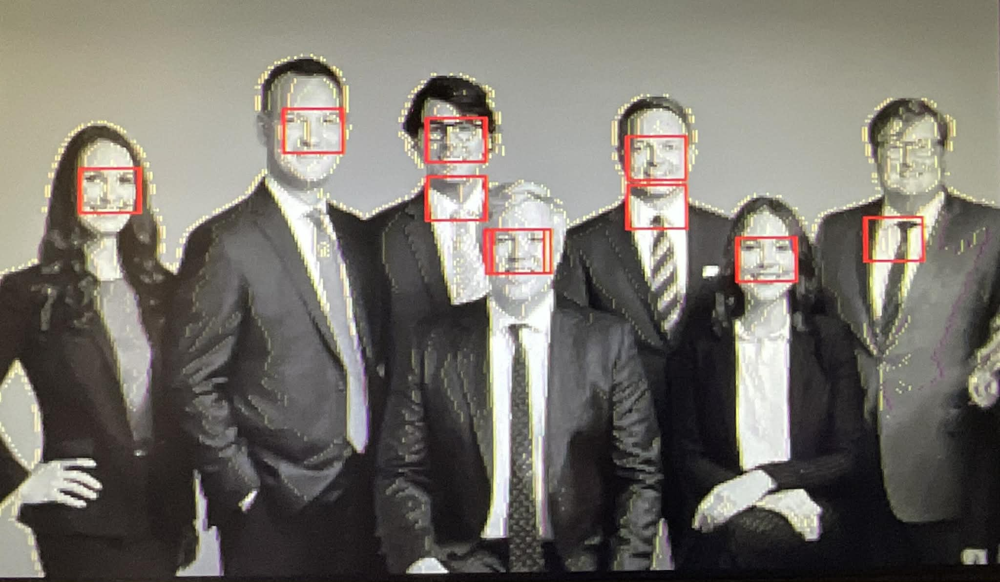

# Computer vision accelerator



Project for a De1-SOC FPGA board that implements a simple computer vision accelerator. The accelerator is capable of performing face detection in real-time using the Viola-Jones algorithm. The Viola-Jones part is currently working, but it is still missing the camera interface. Currently, the 20 frames most likely to contain faces are marked on the screen (VGA output).

Fpga implementation of the Viola-Jones algorithm for face detection reduces power consumption to 6 Watts and achieves significantly lower latency compared to traditional CPU implementations, making it ideal for real-time applications in embedded systems.

Drawback: Not precise yet, many false positives.

Implemented:
- Viola-Jones face detection algorithm
- Haar feature extraction
- Integral image computation
- VGA output streaming


Viola Jones parameters training was performed in python using custom scripts. The trained parameters were then exported to be used in the FPGA implementation. Python training will be made available in the separate repository.

# TCL script to load the MIF file into the FPGA memory
```
set m [lindex [get_service_paths master] 0]
open_service master $m
set base 0x00000000

set fd [open "C:/your_path/img320x240.mif" r]
while {[gets $fd line] >= 0} {
    if {[regexp {^\s*([0-9A-Fa-f]+)\s*:\s*([0-9A-Fa-f]+)\s*;} $line -> addr data]} {
        scan $addr %x a
        scan $data %x d
        master_write_8 $m [expr {$base + $a}] $d
    }
}
close $fd
close_service master $m
```